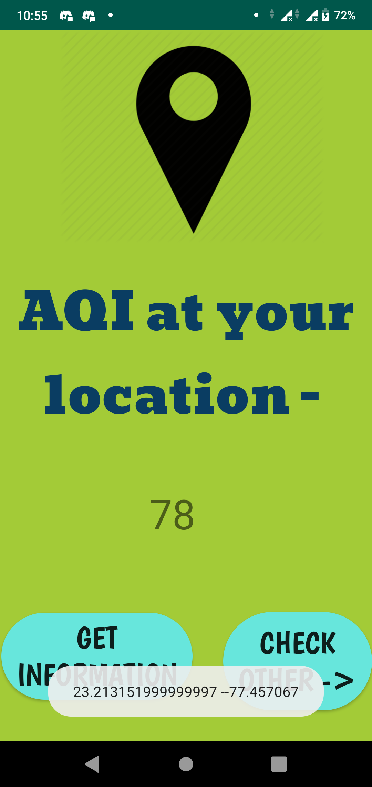
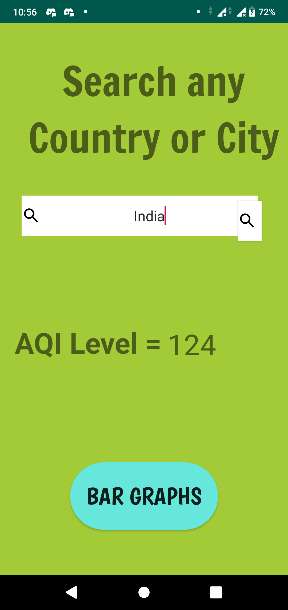
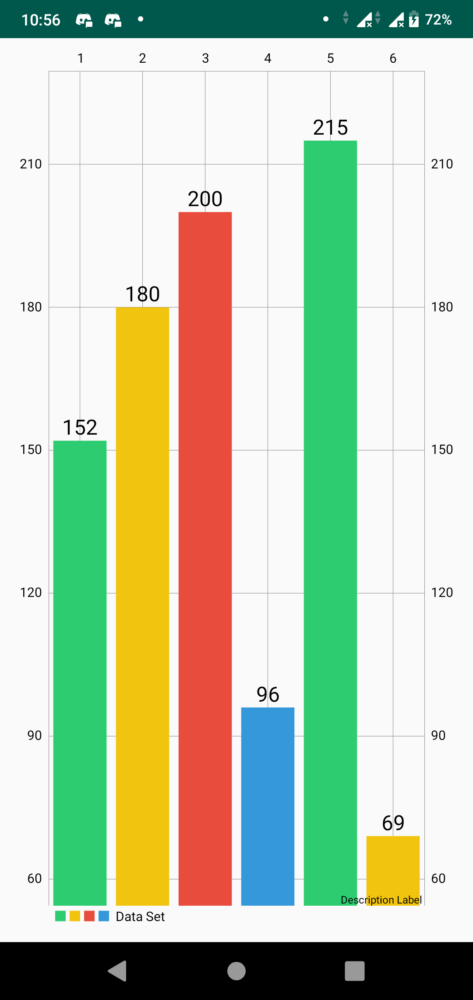
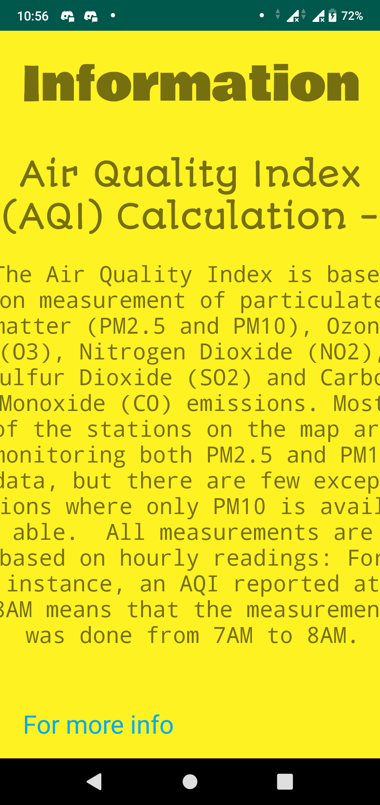

# Hackcovit_AQI
THIS IS MY COPY. MIZAN IS MAKING THIS CHANGE.
MIZAN WAS HERE.
HELLO. GOODBYE.
This repository is made for the purpose of Hackcovit.
We have developed an app which checks the Air Quality index. The app uses location permissions to show AQI of your location then you can search AQI of different countries and cities as well.
We used the following json file API - 
https://aqicn.org/json-api/doc/

Rights of all the data related to AQI is reserved with - https://aqicn.org/api/

# Screenshots of the App
                                                                                                                                                                                
